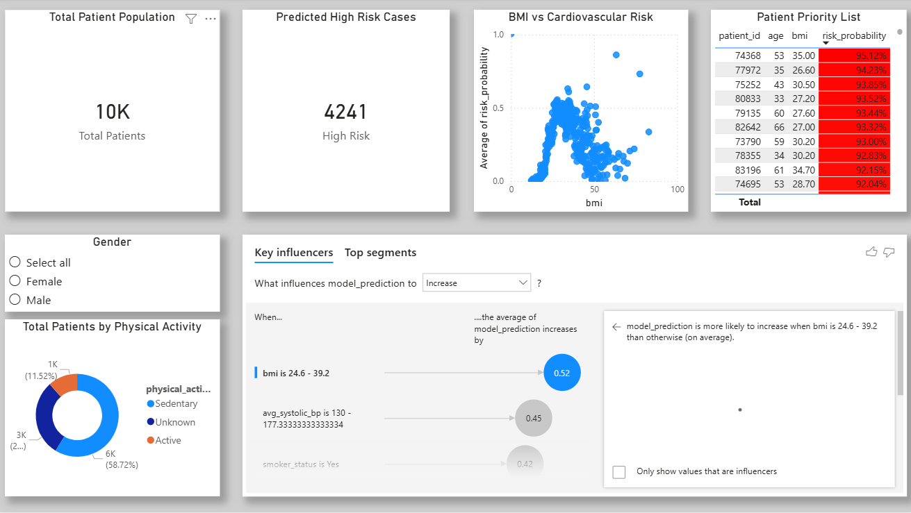

# Cardiovascular Risk ELT Pipeline

A clinical data pipeline designed to identify high-risk cardiovascular patients using the NHANES dataset. 

---

## The Tech Stack
* **Data Engineering:** dbt (Data Build Tool) & Google BigQuery (SQL)
* **Machine Learning:** Python (XGBoost, Scikit-Learn, Pandas)
* **Business Intelligence:** Power BI
* **Version Control:** Git & GitHub

## Project Architecture & Logic
1.  **Transformation (dbt):** Raw NHANES files (Demographics, Labs, Diet, etc.) are processed in BigQuery. dbt handles the modular SQL transformations, including medical code mapping and feature engineering for model readiness.
2.  **Modeling (XGBoost):** A classification model was trained to predict cardiovascular risk. 
    * **Recall-Optimized:** Achieved **83% Recall**. In healthcare, minimizing false negatives is prioritized over precision to ensure patient safety.
3.  **Visualization (Power BI):** Final model outputs and risk drivers are visualized in an interactive dashboard for clinical stakeholders.

## Key Features
* **Automated ELT:** Modular SQL code that turns fragmented survey data into usable, analytics ready data.
* **Explainable AI:** Feature importance analysis highlighting key drivers like **Age**, **Systolic Blood Pressure**, and **BMI**.
* **Standardized Coding:** Integrated NHANES variable mapping to ensure clinical accuracy.

## Repository Guide
Everything is organized within the `/nhanes_project` directory:
* **`/models`**: dbt SQL models defining the transformation logic.
* **`Healthcare_Analysis.ipynb`**: The Python notebook containing the XGBoost training pipeline and evaluation metrics.
* **`Cardiovascular_Risk_Dashboard.pbix`**: The interactive Power BI dashboard file.

---
## Dashboard Preview

